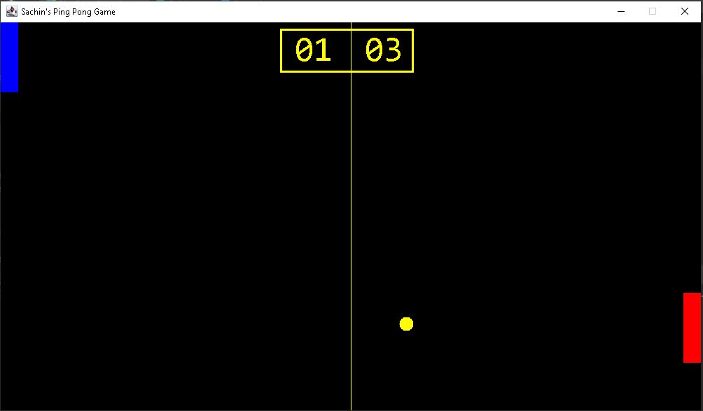

# 🏓 Ping Pong Game
The classic Ping Pong game written in Java.

The PingPongGame.java class needs to be run in order to start the game. 
The GameFrame.java class creates Frame and GamePanel.java adds Panel on which our all components are placed. 
The Ball.java class creates the ball and controls its movement. 
The Paddle.java class creates the paddles the players use and controls its movements. 
The Score.java class displays the scores of player1 and player2. 

## 🕹 Game Instructions

This is a simple GUI based game with the objective to hit the ball with the paddle and not let it leave the game screen. 

Player 1 can control its paddle using W and S keys. 
Player 2 can control its paddle using UP and DOWN ARROW keys. 

### Screenshot

